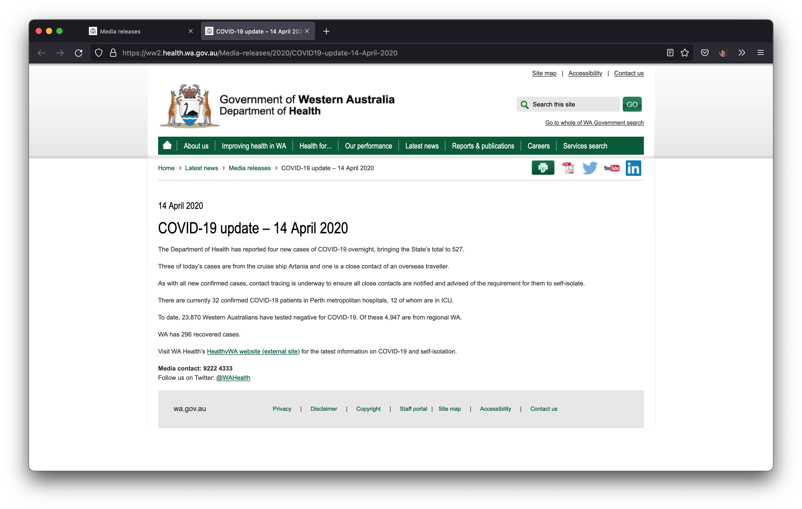

The West Australian State Government has overall handled COVID-19 quite well, but in the arena of making my regex elegent they are have failed completely.  (Almost) every day since March 2020 they have published a media release detailing the number in overnight cases identified and other updates about the pandemic in the state.



For the first 2 years, this was sufficient for me, since for the most part WA was both physically isolated and had restrictions on who could enter the state.  This led us to have very little community transmission, only having minor and shortlived clusters of cases every few months.

All good things must come to an end, and COVID-19 v5.0 Omicron debuted in WA on Christmas Eve 2021.  Since then I've (somewhat unhealthily) been compulsively checking the listing of [media releases](https://ww2.health.wa.gov.au/News/Media-releases-listing-page) every day to find the number of local cases. 

## Why not automate this?

](https://imgs.xkcd.com/comics/automation.png "'Automating' comes from the roots 'auto-' meaning 'self-', and 'mating', meaning 'screwing'.")

Web scraping can't be that hard, right?  It's not, but person writing the media releases clearly is trying to spite me. The [scraping script I wrote](https://github.com/pavo-etc/wa-covid-tracker/blob/main/scraper.py) first generates a list of every update since a given date by traversing the DOM with Beautiful Soup and parsing the article titles.  This would be fine but on a whim the release titles will change format:

```
COVID-19 update 18 March 2020
COVID-19 update – 19 March 2020 (em dash)
COVID-19 update - 17 October 2020 (hyphen)
COVID-19 update – 1 October 2020 (em dash & no leading 0)
COVID-19 update – 01 January 2021 (em dash & leading 0)
COVID-19 update - 05 January 2021 (hyphen & leading 0)
COVID 19 update 2 December 2020 (COVID 19)
COVID19 update – 13 July 2020 (em dash & COVID19)
COVID-19 update –  4 October 2020 (em dash & 2-space gap)
COVID-19 update: 6 March 2022 (colon)
COVID-19 update  7 March 2022 (2-space gap)
COVID-19 update: 27th March 2022 (colon and ORDINAL)
```

Gross.  The somewhat warty regex I resigned myself to:

```python
match_text = "COVID.?19( )+(U|u)pdate.{0,6}[0-9]+(st|nd|rd|th)?( )+[a-zA-Z]+( )+[0-9]{4}"
```

I part of this I'm least proud of is `.{0,6}`, to just match up to 6 arbitrary characters.  It's hacky but it does allow for the media releases to have more inexplicable spacing errors or random characters to use as seperators.

Ordinals only appeared in March 2022 and are what motivated my to whine about this on the internet.  They are particularly annoying to my program since it only scrapes articles since the previous run.  This is calculated by parsing the date in the media release title which is frustrating when they change the format of their dates on a whim.  It's not a major change to the codebase, but it's just another spaghetto in my spaghetti.

## Spaghetto 2: Actual Data 

The titles are just the first issue.  Once a list of COVID-19 updates has been assembled, each link is opened by Beautiful Soup, and the content of all `<p>` tags are concatenated.  The case numbers are written in normal and again inconsistent sentences.  The concatenated string is searched with more inelegant (and shockingly functional) regex to attempt to find the number of total new cases and locally transmitted cases.

```python
# For local cases
match_text = "(total )?(of )?(([0-9]|,)+) new(?! local)( COVID-19)?( case(s?))?"
# For all cases
match_text = "(([0-9]|,)+)( are)?( new)? local( COVID-19)?( cases)?"
```

This took a surmountable and annoying amount of trial and error to find, and I'm sure will need updating in the future when the Government changes their phrasing on their next whim.

# Ongoing Development...

For now [this setup](https://tracker.zachmanson.com) works without much any effort from me, barring the occasional regex update.

Unfortunately, this experience hasn't turned me off web scraping so I feel a niggling desire to add more functionality to the site.  Daily hospitalisations, deaths, and other morbidities are all tempingly trivial to add, right?  It's hard to call a project complete, even when you've already done everything you set out to do.  I have a sneaking suspicious that the xkcd comic will be more prophetic than I'd like.